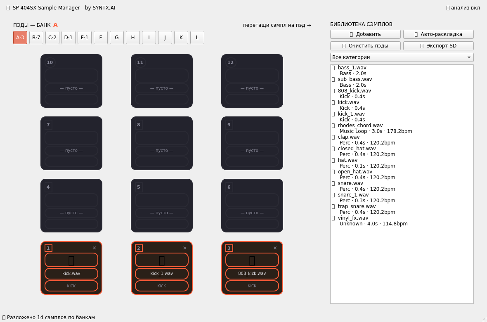

# 🎛️ SP-404SX Sample Manager — Desktop (PySide6)

Нативное десктопное приложение для управления сэмплами Roland SP-404SX.
**Без Flask, без браузера, без JS** — чистый Qt (PySide6).

Вдохновлено проектом [super-pads](https://github.com/MatthewCallis/super-pads).



## ✨ Возможности

- **Авто-классификация** сэмплов через `librosa`
  (kick, snare, hi-hat, clap, perc, bass, melody, loops, FX, vocal)
- **Сетка пэдов** 12 банков (A–L) × 12 пэдов — раскладка как на реальном
  устройстве (пэды 1–3 внизу, 10–12 сверху)
- **Drag & Drop** — перетащи сэмпл из библиотеки на любой пэд
  (или перетащи аудиофайлы/папки прямо в окно для импорта)
- **Встроенный плеер** — двойной клик по сэмплу или клик по пэду = прослушивание
  (через `QtMultimedia`)
- **✨ Авто-раскладка** — каждая категория раскидывается по своему банку
- **Фильтр** по категориям
- **Фоновая обработка** — анализ и экспорт в отдельном `QThread`,
  UI не подвисает
- **💾 Экспорт SD** — генерирует структуру `ROLAND/SP-404SX/SMPL/`
  с правильными именами (`A0000001.WAV`), конвертацией в 44.1kHz/16-bit,
  манифестом и ZIP-архивом
- **Автосохранение проекта** в `~/.sp404_manager/project.json`

## 📦 Установка

```bash
pip install -r requirements.txt
```

На Linux для `QtMultimedia` могут понадобиться системные библиотеки:

```bash
sudo apt install libxkbcommon0 libpulse0 libasound2
```

## 🚀 Запуск

```bash
python main.py
```

## 🗂️ Формат экспорта

Файлы называются `<Банк><7 цифр номера пэда>.WAV`:

| Пэд | Файл |
|-----|------|
| Банк A, Пэд 1 | `A0000001.WAV` |
| Банк B, Пэд 5 | `B0000005.WAV` |

Структура на SD-карте:

```
SP-404SX_SD/
└── ROLAND/
    └── SP-404SX/
        └── SMPL/
            ├── A0000001.WAV
            ├── B0000001.WAV
            └── ...
```

Распакуй ZIP в корень SD-карты — SP-404SX подхватит сэмплы.
Формат согласно спецификации: <https://athanasi.us/site/sp404_file_format.html>

## 📁 Структура проекта

```
sp404_qt/
├── main.py             # GUI-приложение (PySide6)
├── analyzer.py         # движок анализа/классификации (librosa)
├── exporter.py         # экспорт в формат SD-карты + авто-раскладка
├── requirements.txt
├── test_headless.py    # end-to-end тест (offscreen)
└── screenshot.png
```

## 🧩 Архитектура

- **`analyzer.py`** и **`exporter.py`** не зависят от GUI — их можно
  переиспользовать в CLI или другом фронтенде.
- **`main.py`**: `MainWindow` + кастомный `PadWidget` (drag&drop target)
  + `SampleList` (drag source) + воркеры `AnalyzeWorker` / `ExportWorker`
  на `QThread`.

## ⚙️ Работа без librosa

Если `librosa` не установлен, приложение всё равно запустится:
классификация будет отключена (все сэмплы → `unknown`), но назначение
на пэды, drag&drop и экспорт продолжат работать (WAV копируется как есть).
